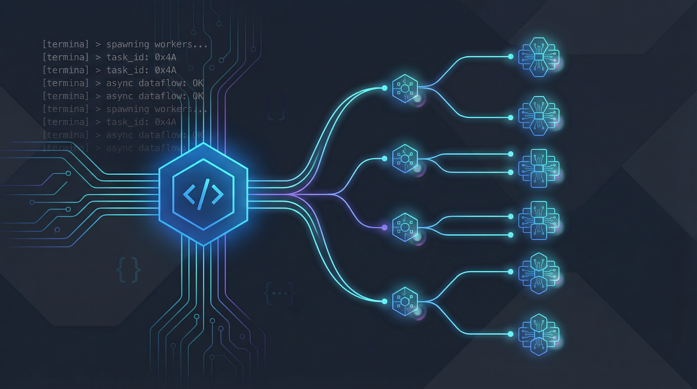

<p align="center">
  
</p>

<h1 align="center">opencode-background-tasks</h1>

<p align="center">
  Background task delegation and orchestration plugin for <a href="https://github.com/anomalyco/opencode">OpenCode</a>.<br/>
  Fan out complex work across multiple agents running in parallel — without leaving your session.
</p>

<p align="center">
  <a href="#features">Features</a> &bull;
  <a href="#installation">Installation</a> &bull;
  <a href="#usage">Usage</a> &bull;
  <a href="#tools">Tools</a> &bull;
  <a href="#configuration">Configuration</a> &bull;
  <a href="#how-it-works">How It Works</a>
</p>

---

## Features

- **Background delegation** — Launch tasks that run asynchronously while your main session continues.
- **Multi-agent orchestration** — Route work to specialized agents (`build`, `plan`, `debug`, `consultant`) based on the deliverable.
- **Target-based overlap detection** — Declare file targets per task so the plugin can detect and prevent conflicting edits.
- **Isolated git worktrees** — Automatically spin up dedicated worktrees for tasks that would otherwise conflict, with patch-based reconciliation when they complete.
- **Child session guardrails** — Child sessions cannot re-delegate, preventing runaway task trees.
- **Logical task IDs** — Assign human-readable IDs to tasks for easy reuse and reconciliation.
- **Completion callbacks** — Results are automatically queued back into the parent session when a background task finishes.
- **Non-git workspace support** — Works in non-git directories with explicit target-based concurrency control.

## Installation

### Local plugin (recommended)

Copy `task.js` into your OpenCode plugins directory:

```bash
mkdir -p ~/.config/opencode/plugins
cp task.js ~/.config/opencode/plugins/task.js
```

OpenCode automatically loads `.js` plugins from `~/.config/opencode/plugins/` — no config changes needed.

### From this repo

```bash
git clone https://github.com/AutomatorAlex/opencode-background-tasks.git
cp opencode-background-tasks/task.js ~/.config/opencode/plugins/task.js
```

## Usage

Once installed, three new tools become available in every OpenCode session:

### Delegate a task

```
task(
  prompt: "Refactor the auth module to use JWT tokens",
  subagent_type: "build",
  description: "Refactor auth to JWT",
  targets: ["src/auth/**"],
  mode: "auto"
)
```

### Fan out parallel work

```
task(prompt: "Write unit tests for the API layer", subagent_type: "build", targets: ["tests/api/**"])
task(prompt: "Update the README with new endpoints", subagent_type: "build", targets: ["README.md"])
task(prompt: "Plan the database migration strategy", subagent_type: "plan", targets: ["docs/migration.md"])
```

All three run concurrently because their targets don't overlap.

### Reuse a task session

```
task(
  prompt: "Continue the auth refactor — add refresh token support",
  subagent_type: "build",
  task_id: "auth_refactor",
  targets: ["src/auth/**"]
)
```

If `auth_refactor` was used before, the existing session is reused. Otherwise a new session is created and mapped to that ID.

## Tools

### `task`

Launch a background agent task.

| Parameter | Type | Required | Description |
|-----------|------|----------|-------------|
| `prompt` | string | yes | The task instructions for the agent |
| `subagent_type` | string | yes | Agent type: `build`, `plan`, `debug`, `consultant` |
| `description` | string | yes | Short label (3-5 words) |
| `task_id` | string | no | Logical task identifier for reuse |
| `targets` | string[] | no | Files or globs this task may edit |
| `mode` | `"auto"` \| `"shared"` \| `"isolated"` | no | Workspace strategy (default: `auto`) |
| `command` | string | no | The command that triggered this task |

### `task_list`

List all active background tasks and any completed isolated tasks waiting for reconciliation.

### `task_reconcile`

Inspect or apply patches from isolated background tasks.

| Parameter | Type | Required | Description |
|-----------|------|----------|-------------|
| `task_id` | string | yes | Task session ID or logical task ID |
| `action` | `"status"` \| `"apply"` \| `"cleanup"` | yes | What to do with the task |

- **status** — Show reconciliation metadata
- **apply** — Apply the recorded patch to the main workspace via `git apply --3way`
- **cleanup** — Remove the worktree and branch, retaining the patch artifact

## Configuration

### Agent discovery

The plugin reads agent definitions from `~/.config/opencode/agents/*.md` and filters to the core set: `build`, `consultant`, `debug`, `plan`. Each agent markdown file can include frontmatter:

```markdown
description: Generalist coder for implementing features
model: openrouter/anthropic/claude-sonnet-4
variant: default
```

### Artifacts directory

Background task artifacts (worktrees, patches) are stored in:

```
~/.local/share/opencode/background-task-artifacts/
├── worktrees/    # Isolated git worktrees
└── patches/      # Recorded patches from completed isolated tasks
```

## How It Works

### Delegation flow

```
Root Session
  │
  ├─ task(prompt, agent, targets) ──► Creates child session
  │                                    ├─ Checks for target conflicts
  │                                    ├─ Resolves workspace mode (shared/isolated)
  │                                    ├─ Creates git worktree if isolated
  │                                    └─ Sends prompt to child session async
  │
  ├─ (continues working)
  │
  └─ ◄── Completion callback ──────── Child session goes idle
                                       ├─ Extracts final result
                                       ├─ Collects changed files + patch
                                       └─ Queues result into parent session
```

### Overlap detection

When a task declares targets like `["src/auth/**", "src/middleware.ts"]`, the plugin:

1. Normalizes paths relative to the repository root
2. Compares against all active tasks using glob-aware overlap detection
3. If overlap is found in `auto` mode and the project is a git repo, escalates to `isolated` mode
4. If overlap is found in `shared` mode, rejects the task with a clear error

### Isolated worktree lifecycle

1. **Create** — `git worktree add -b opencode-task-xxx <path> HEAD`
2. **Work** — Child session operates in the worktree directory
3. **Complete** — Plugin diffs against HEAD, saves a `.patch` file
4. **Reconcile** — Parent session applies the patch via `git apply --3way`
5. **Cleanup** — Worktree and branch removed, patch retained for audit

## Requirements

- [OpenCode](https://github.com/anomalyco/opencode) with plugin support
- Node.js (for the plugin runtime)
- Git (for isolated worktree mode)

## License

[MIT](LICENSE) — Alex De Gracia
